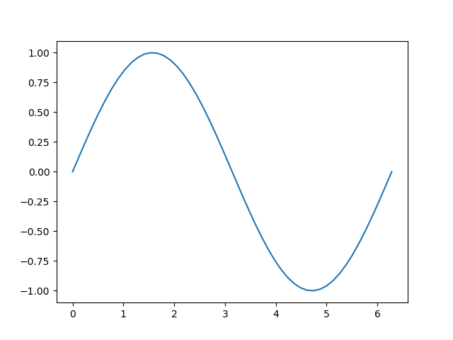

% Akaflieg Python Tutorial

# Installation

In der Regel bietet sich die Installation von Python mit der *Anaconda Distribution* an. Diese bringt Python in einer aktuellen Version, kombiniert mit einer Vielzahl von Paketen mit, was den Installationsaufwand enorm reduziert.

Installationsdateien für alle üblichen Plattformen finden sich unter [Anaconda Download](https://www.anaconda.com/download/).

## Versionen
Python gibt es momentan noch in zwei Versionen: Python 2 und Python 3. Die beiden Versionen sind zwar ähnlich, dürfen aber nicht als austauschbar gesehen werden. Python 2 wird nur noch bis 2020 weiterentwickelt und sollte allein deshalb nicht mehr verwendet werden. Trotzdem muss man beachten dass manche Beispiele im Internet nur unter Python 2 funktionieren und ein wenig angepasst werden müssen.

# Grundlagen

## Hallo Welt

### Prompt
Es gibt veschiedene Arten und weisen ein Python-Befehle auszuführen. Die einfachste und schnellste Art und weise ist in einer Prompt. Eine Prompt ist ein CMD-Fenster in das man Python-Code schreiben kann, der sofort ausgeführt wird. Das ist praktisch um schnell kleine Programm-Schnipsel zu testen aber nicht um ein volles Programm zu schreiben.

Unter Anaconda öffnet man eine Prompt mit dem Programm "Anaconda Prompt". Darin kann dann "python" eingegeben werden um eine Python Prompt zu öffnen.

Wir wollen so ein "Hallo Welt"-Programm testen. Öffnet man die Python Prompt kann man den Befehl um "Hallo Welt" auszugeben direkt eingeben. Aussehen sollte das so:
```
>>>print("Hallo Welt!")
Hallo Welt!
```

### Datei
Eine praktischere Möglichkeit ein Programm auszuführen ist es in eine Datei zu schreiben und dann den Python Interpreter mit dieser Datei aufzurufen. Dazu schreibt man zum Beispiel eine Datei mit dem Inhalt:
```
print("Hallo Welt!")
```
und ruft aus einem Terminal (CMD) das Skript auf.
```
>python hallo.py
Hallo Welt!
```

### Notebook
Eine komfortable Option in Python zu programmieren sind IPython/Jupyter Notebooks. Ein Notebook ist eine Datei die aus einer Mischung aus Text und Code besteht. So eine Datei ist aus jeweiligen Blöcken aufgebaut. Diese Blöcke können einzeln ausgeführt, bearbeitet und Verschoben werden.
Erstellt man einen Code Block mit der Schaltfläche mit dem Plus kann man dort den jeweilgen Teil des Programms eingeben und dann mit Shift+Enter ausführen.
In einem Textblock kann auch LaTeX Math verwendet werden um Formeln darzustellen.

Ein Notebook öffnet man unter Anaconda mit dem Programm "Jupyter Notebook". Bei dessen Ausführung sollte sich automatisch ein Browser öffnen, in dem ein Notebook ausgewählt werden kann.

## Variablen
Um ein paar Python ausdrücke auszuprobieren wollen wir ein paar einfache Rechnungen anstellen.
Das funktioniert ziemlich genau wie man das Erwartet, bzw. von Matlab etc kennt.
```
>>> 2 + 2
4
>>> 1 - 2*2
-3
>>> 5/2
2.5
```

Eine Zahl ohne Komma heißt ein Integer. Ein Integer kann nur ganzzahlen darstellen.
Der Teilen-Operator '/' liefert aber immer eine Kommazahl zurück, zu erkennen and dem Nachkommateil.

```
>>> 2/3
0.6666666666667
>>> 2/2
1.0
```

Ganzzahlige Division nutzt den Operator '//'.
```
>>> 17//3
5
```

Weitere Operatoren sind '\*\*' für Potenzen und '%' für Modulo.

Man kann eine Zahl in einer Variable speichern durch eine Zuweisung.
```
>>> nichtpi = 3
>>> print(nichtpi)
3
>>> print(nichtpi + 1)
4
```

Wenn man Texte verarbeitet, nutzt man Strings, den Datentyp für Zeichenketten.
Strings kann man entweder mit einfachen Hochkommas ', oder doppelten Hochkommas erzeugen ".
Will man zwei Strings aneinander hängen kann man das mit dem '+' Operator.
```
>>> print("Hello")
Hello
>>> print("Hello" + " World")
Hello World
```

Will man Variablen in einen String einfügen kann man das mit dem '.format' Befehl.
Man ruft die Methode 'format' des Strings auf und übergibt diesem die Variablen die man Einfügen möchte.
Die Stelle an der man die Variable einfügen möchte markiert man mit '{}'. Das geht mit beliebig vielen Variablen.
```
>>> projektnummer = 45
>>> print("D-{}".format(projektnummer))
D-45
>>> print("{} + {} = {}".format(1, 2, 1+2))
1 + 2 = 3
```

Eine weitere Art des Datentyps ist ein Wahrheitswert, genannt 'boolean'. Ein boolean kann entweder 'True' oder 'False' sein. Boolean sind insbesondere Interessant für If-Abfragen.
Operatoren auf Boolean sind:
* Und: ```&```
* Oder: ```|```
* Nicht ```!```
* XOR: ```^```

Einige dieser Operatoren kann man auch einfach ausschreiben:
```
>>> True and False
False
>>> False or True
True
>>> not True
False
```

Will man Zahlen miteinander vergleichen gibt es einige Operatoren für Zahlen die Wahrheitswerte liefern:
* Echt kleiner: ```<```
* Kleiner gleich: ```<=```
* Gleich: ```==```
* Größer gleich: ```>=```
* Echt größer: ```>```
* Ungleich: ```!=```

```
>>> 2 < 3
True
>>> 1 + 1 == 2
True
```

## if else und elif
Will man in seinem Programm unterschiedliche Sachen für unterschiedliche Fälle machen benutzt man eine If-Abfrage. In eine If-Abfrage schreibt man einen Ausdruck der einen Boolean ergibt gefolgt von einem Doppelpunkt und einer neuen Zeile. Alles was dann in und nach der neuen Zeile eingerückt steht wird ausgeführt falls der Wert des Boolean True ist.
```
passwort = 'abcdef'
eingabe = 'letmein'

if passwort == eingabe:
  print('access granted')
```

Führt zu:
```access granted```

Will man noch zusätzlich abfragen ob die Bedingung nicht erfüllt ist benutzt man ein ```else```.

```
n = 1234

if n % 2 == 0:
  print("n ist gerade")
else:
  print("n ist nicht gerade")
```

Führt zu:
```n ist gerade```

Hat man allerdings den Fall dass man zwischen mehr als Zwei Fällen unterscheiden will kann man ein else mit einem if verbinden. Ein ```elif```. Ein elif wird nur ausgewertet wenn das vorherige if falsch war und die aktuelle Bedingung wahr ist.
```
stunde = 12

if stunde < 10:
  print("Guten Morgen.")
elif stunde < 14:
  print("Guten Mittag.")
else:
  print("Guten Abend.")
```

Ist der Typ von Variablen unbekannt lässt sich dieser mit der Funktion *type* ermitteln.

## Schleifen
Will man ein Stück Code öfter hintereinander ausführen benutzt man Schleifen. Die wichtige Schleife in Python ist die for-Schleife. Eine for-Schleife führt einen Code Block für jedes Element eines Containers aus (Ein Container ist sowas wie eine Menge/Liste, mehr später).
Zunächst ist es wichtig dass wir eine Liste von Zahlen mit dem ```range``` Befehl erzeugen können.
```
>>> for i in range(10):
      print("{} Bier".format(i))
0 Bier
1 Bier
2 Bier
3 Bier
4 Bier
5 Bier
6 Bier
7 Bier
8 Bier
9 Bier
```

Den Range-Befehl kann man auf drei Arten aufrufen.
Mit nur einem Argument (0 bis):
```
>>> range(5)
[0, 1, 2, 3, 4]
```

Mit zwei Argumenten (von bis):
```
>>> range(5, 10)
[5, 6, 7, 8, 9]
```

Mit drei Argumenten (von bis mit Schrittweite):
```
>>> range(0, 1, 0.2)
[0, 0.2, 0.4, 0.6, 0.8]
```

Die Zweite, weniger verwendete, Art einer Schleife ist die ```while```-Schleife. Die While-Schleife führt so lange aus wie eine Bedingung gilt.
```
>>> f = 1.0e
>>> while f > 0.1:
      f = f/2
>>> f
0.0625
```

## Container
In Python gibt es einige Datentypen die eine Menge an Daten enthalten können. Die wollen wir uns anschauen.

### Tupel
Ein Tupel kann man sich vorstellen wie einen Vektor: Eine Liste von Werten mit **fester**, aber beliebiger Größe.
Tupel werden mit runden Klammern initialisiert.
Will man auf einen Wert aus einem Tupel zugreifen benutzt man einen Index, der Index wird in Eckige klammern nach dem Tupel geschrieben. Tupel sind nicht veränderbar, ist es einmal initialisiert ist es konstant. Die Werte können nur noch geändert werden indem ein neues Tupel erzeugt wird.
```
>>> tupel = (1, 3, 2)
>>> tupel[0]
1
```

### Liste
Eine Liste, auch Array genannt, unterscheidet sich von einem Tupel durch eine veränderliche Größe und dass man Elemente in einer Liste neu zuweisen kann. Indizierung funktioniert gleich. Eine Liste wird durch eckige Klammern erzeugt.
```
>>> liste = [3,1,4,1]
>>> liste[0]
3
>>> liste[1] = 2
>>> liste
[3,2,4,2]
```

Eine Liste kann durch die Methode 'append' erweitert werden.
```
>>> liste.append(5)
>>> liste
[3, 2, 4, 1, 5]
```

Die Länge einer Liste erfährt man durch die eingebaute Funktion 'len' (für lenght).
```
>>> len([1, 2, 3])
3
```

### List Comprehensions
Mit List comprehensions kann man Listen aus anderen Listen erzeugen. Man kann zum Beispiel einen Ausdruck auf jedes Element der Liste anwenden und daraus eine neue Liste erzeugen, und die Liste filtern, also nur die Elemente übernehmen die einer Bedingung genügen.
Eine List comprehension besteht aus eckigen Klammern in denen zunächst der anzuwendende Ausdruck steht, gefolgt von einem 'for'-Statement, welches die Variable kennzeichnet die die einzelnen Listenelemente darstellt, darauf können einzelne 'if'-Statements folgen, die etwaige bedingungen angeben.

Wollen wir zum Beispiel alle Zahlen einer Liste quadrieren:
```
>>> liste = [1,2,3]
>>> [x**2 for x in liste]
[1, 4, 9]
```

Als weiteres Beispiel wollen wir den Logarithmus aller Zahlen einer Liste errechnen, aber nur für Zahlen größer 1.
```
>>> import math
>>> liste = [0.5, 1, 2, 4]
>>> [math.log(x) for x in liste if x > 1]
[0.6931471805599453, 1.3862943611198906]
```
(import math muss ausgeführt werden um die math-Bibliothek verfügbar zu machen)

### Dictionary
Ein Dictionary ist eine Datenstruktur, deren Indizes nicht Zahlen sondern Strings sind. Man kann also jedem String in einem Dictionary einen Wert zuordnen. Dictionaries werden mit geschweiften Klammern initialisiert.
Dictionaries sind, wie Arrays, veränderbar und können erweitert werden. Zum erweitern eines Dictionaries kann einfach einem Index ein wert zugeordnet werden.
```
>>> dict = {'eins': 1, 'zwei': 2, 'fünfundzwanzig':25}
>>> dict['eins']
1
>>> dict['vier'] = 4
>>> dict['vier']
4
```

## Methoden und Funktionen

Hat man sich jetzt einige Abläufe ausgedacht die das Programm durchlaufen soll, kommt man zwangsweise zu dem Punkt an dem man ein Stück code noch einmal ausführen möchte, allerdings mit anderen werten. Um den Code nicht einfach wiederholen zu müssen kann man ihn in einer Methode zusammenfassen.
Wir wollen eine Methode schreiben, die beliebig oft das Wort "Bier" ausgibt und dabei Mitzählt. Wir übergeben der Methode als "Parameter" die Zahl "wie\_oft", die angibt wie oft "Bier" ausgegeben werden soll.

```
def sage_bier(wie_oft):
  for i in range(wie_oft):
    print(i, "Bier")
```

Diese Methode können wir nun aufrufen und uns beliebig oft "Bier" ausgeben lassen. (Ein Satz der nur in der Informatik realistisch zu verwenden ist.)

```
>>> sage_bier(4)
0 Bier
1 Bier
2 Bier
3 Bier
```

Eine Funktion ist eine Methode, die einen Rückgabewert besitzt. Die also, einer mathematischen Funktion ähnlich, die Parameter verwendet um einen neuen Wert zu errechnen und dann an den Aufrufer zurückzuliefern.
Eine Rückgabe in einer Funktion geschieht mit dem Befehl 'return'. Auf das return folgt dann der Rückgabewert.
Wird return in einer Funktion aufgerufen wird die Ausführung der Funktion sofort beendet und zum Aufrufer zurückgekehrt.

```
def addiere_zwo(x):
  return x+2
```
```
>>> addiere_zwo(2)
4
```

In zugegebenermaßen seltenen Fällen kann es nützlich sein eine Funktion "auf die schnelle" und unbenannt zu definieren. Dafür kann man lambda-expressions verwenden. Wir wollen nicht weiter ins Detail gehen, deshalb nur ein Beispiel.
```
>>> f = lambda x: x*2
>>> f(2)
4
>>>(lambda x: x-2)(2)
0
```

### Sichbarkeit
Variablen sind nicht unendlich lange gültig. Eine Variable lebt nur in ihrem "Scope" (dt. Sichtarkeitsbereich). Befindet man sich außerhalb des Scopes einer Variable kann sie nicht mehr verwendet werden. Wird ein Variable innerhalb einer Funktion das erste mal definiert ist diese Funktion ihr Scope, er ist "lokal". Hat die Ausführung die Funktion verlassen ist die Variable ungültig. Eine Variable die im globalen Kontext definiert wurde hat einen globalen Scope und kann von überall in dem Programm verwendet werden. Dabei ist allerdings Vorsicht geboten, globale Variablen können Einfluss auf die Ausführung nehmen die nur schwer zu erkennen sind. So kann eine Funktion mit gleichen Parametern zwei mal unterschiedliche Rückgabewerte liefern.

### Call by reference / Call by value
Wird ein Parameter einer Funktion übergeben kann das, je nach Parameter, auf zwei Arten geschehen.

Wird "by reference" übergeben handelt es sich um einen "Verweis" auf das eigentliche Objekt. Das hat zur Folge dass eine Änderung an dem Parameter auch auf die ursprüngliche Variable übertragen wird, die änderung bleibt also nicht lokal.
Arrays werden zum Beispiel "by reference" übergeben.

```
>>> liste = [1,2,3]
>>> def verarbeite_liste(l):
      liste[0] = 0
>>> verarbeite_liste(liste)
>>> liste
[0,2,3]
```

Wird "by value" übergeben sind änderungen nur lokal und übertragen sich nicht auf das ursprüngliche Objekt. "by value" werden alle primitiven Datentypen wie ints, floats, booleans und strings übergeben.
```
>>> n = 0
>>> def verarbeite_zahl(x):
      x = 1
>>> verarbeite_zahl(n)
>>> n
0
```

Unter umständen ist es aber erwünscht Änderung lokal zu halten und nicht auf das ursprüngliche Objekt zu übertragen. Dazu muss man den Parameter kopieren. Bei Arrays geht das mit einem einfachen Slice. Für alle anderengg

## Klassen

# Matrizenrechnung (numpy)

Das numpy-Paket ist einer der Grundpfeiler für wissenschaftliches Programmieren in Python. Es stellt mit dem array-Objekt eine Datenstruktur zur Verfügung, die in der Lage ist N-dimensionale Matrizen abzubilden. Grundlegende Funktionen zum Arbeiten mit dem array-Objekt gehören außerdem zu numpy.

Um das numpy-Paket nutzen zu können, muss es zuerst eingebunden werden. Dies geschiet meist mit folgendem Aufruf:

```
import numpy as np
```

Damit wir das numpy-Paket geladen und unter dem Bezeichner 'np' zur Verfügung gestellt.

## Erstellen von Arrays

Das Erstellen von Arrays kann auf zahlreichen Wegen geschehen. Oft werden Arrays mithilfe von Listen erstellt. Ein eindimensionales Array mit den Einträgen 1, 2 und 3 erzuegt folgender Befehl:

```
a = np.array([1,2,3])
```

Der Zugriff auf Elemente des eindimensionalen Arrays erfolgt mit eckigen Klammern. Die Indizes zum Zugriff auf Werte beginnen bei 0. Für den ersten Array-Eintrag muss folgender Befehl ausgeführt werden:

```
>>> a[0]
1
```

Die Einträge lassen sich durch Überschreiben mit neuen Werten ändern:

```
>>> a[0] = 5
>>> a
[5,2,3]
```

Wird ein eindimensionales Array mit einer Reihe von Einträgen konstanten Abstandes benötigt, kann die Funktion *arange* verwendet werden:

```
>>> np.arange(1,4,1)
[1,2,3]
```

Der erste übergebene Parameter bildet den Startwert, während der zweite das Ende darstellt. Mit dem dritten Parameter wird der Abstand zwischen den Array einträgen festeglegt. Es lassen sich für alle Parameter nicht ganzzahlige Werte übergeben. Ist der Abstand zwischen benachbarten Array-Einträgen unwichtig, aber die Anzahl von Werten festgelegt kann *linspace* verwendet werden:

```
>>> np.linspace(1, 2, 101)
[1.0, 1.01, 1.02, ... , 1.99,2.00]
```

Neben eindimensionalen Arrays können mehrdimensionale Arrays durch geschachtelte Listen erzeugen. Ein zweidimensionales Array wird beispielsweise mit folgendem Aufruf erstellt:

```
b = np.array([[1,2,3],[4,5,6]])
```

Der Inhalt von *b* lässt sich als Matrix darstellen:

$$ \boldsymbol{b} = \begin{pmatrix} 1 & 2 & 3 \\ 4 & 5 & 6\end{pmatrix}$$

Es gibt 2 Zeilen und 3 Spalten. Diese Größe lässt sich direkt über die *shape*-Eigenschaft ermitteln:

```
>>> b.shape
(2,3)
```

Der Zugriff auf einzelne Elemente erfolgt jetzt über die Angabe der gewünschten Zeile und Spalte

```
>>> b[1,1]
5
```

Statt der Listen können auch Tuple verwendet werden um Arrays zu initialisieren. Weiterhin gibt es zahlreiche Funktionen spezielle Matrixformen zu erzeugen. Mit *zeros* kann zum Beispiel ein Array definierter Größe erstellt werden, dessen Einträge alle zu Null gesetzt sind.

```
>>> np.zeros((3, 3))
[[0, 0, 0], [0, 0, 0], [0, 0, 0]]
```

Analog dazu existiert eine Funktion *ones*, die alle Einträge mit Eins initialisiert. Ein Array definierter Größe mit beliebigem konstanten Wert kann wird mit *full* erzeugt:

```
>>> np.full((3, 3), 3.4)
[[3.4, 3.4, 3.4], [3.4, 3.4, 3.4], [3.4, 3.4, 3.4]]
```

Zum Erstellen der Einheitsmatrix kann *eye* verwendet werden:

```
>>> np.eye((3, 3))
[[1.0, 0.0, 0.0],[0.0, 1.0, 0.0],[0.0,0.0,1.0]]
```

Außerdem existiert eine Funktion zur Initialisierung mit zufälligen Werten:

```
>>> np.random.random((3, 3))
```

## Rechenoperationen mit Arrays

Berechnungen mit Arrays gleicher Größe erfolgen im Normalfall Elementweise. So wird die Addition von Arrays mit dem *+*-Operator oder der *add*-Funktion elementweise durchgeführt:

```
>>> a1 = np.array([[1.2, 1.3],[0.9, 1.2]])
>>> a2 = np.ones((2,2))
>>> a1 + a2
[[2.2, 2.3], [1.9, 2.2]]
>>> np.add(a1, a2)
[[2.2, 2.3], [1.9, 2.2]]
```

Analog erfolgt die elementweise Multiplikation von Arrays mit dem __*__-Operator oder der *multiply*-Funktion.

```
>>> a1 = np.array([[1.2, 1.3],[0.9, 1.2]])
>>> a2 = np.full((2,2),2)
>>> a1 * a2
[[2.4, 2.6], [1.8, 2.4]]
>>> np.multiply(a1, a2)
[[2.4, 2.6], [1.8, 2.4]]
```

Gleiches gilt für die Division, die mit dem Operator */* oder der Funktion *divide* erfolgt und die Subtraktion ( *-* und *subtract*).

Auf zweidimensionale Arrays kann auch das Matrixprodukt angewandt werden. Hierfür gibt es den Operator *@* und die Funktion *matmul*.

```
>>> a1 = np.array([[1.2, 1.3],[0.9, 1.2]])
>>> a2 = np.full((2,2),2)
>>> a1 @ a2
[[5.0, 5.0], [4.2, 4.2]]
>>> np.matmul(a1, a2)
[[5.0, 5.0], [4.2, 4.2]]
```

Außerdem kann für eindimensionale Arrays (Vektoren) mit der Funktion *dot* das Skalarprodukt (inneres Produkt) gebildet werden:

```
>>> a1 = np.array([1, 2, 2])
>>> a2 = np.array([2, 3, 2])
>>> np.dot(a1, a2)
[2, 6, 4]
```

Für das Kreuz- oder Vektorprodukt zweier 3D-Vektoren gibt es die *cross*-Funktion:

```
>>> a1 = np.array([1, 2, 2])
>>> a2 = np.array([2, 3, 2])
>>> np.cross(a1, a2)
[-2, 2, 1]
```

### Aggregationsfunktionen

Es gibt außerdem Funktionen wie *sum* um die Summe von Array-Einträgen zu bilden, die zusammenfassenden Charakter haben. Dazu gehören neben *sum* unter anderem:
* *prod* zum Bestimmen des Produktes der Array-Einträge
* *mean* zum Bestimmen des arithmetischen Mittelwertes

Beim Aufruf dieser Funktionen kann mithilfe des *axis* Parameters festgelegt über welche Dimensionen des Arrays sie gebildet werden. Ohne Angabe des Paramters wird die Funktion über alle Dimensionen gebildet - Ergebnis ist ein Skalar, z.B.

```
>>> a = np.array([1,2,3])
>>> np.sum(a)
6
```

Dagegen können zum Beispiel für ein zweidimensionales Array nur Zeilen oder Spalten aufaddiert werden:

```
>>> a = np.array([[1,2,3],[1,2,3]])
>>> np.sum(a)
12
>>> np.sum(a, axis=0)
[2,4,6]
>>> np.sum(a, axis=1)
[[6],[6]]
```

## Broadcasting

Bislang wurden Rechenoperationen immer mit Arrays gleicher Form (*shape*) durchgeführt. Liegen zwei Arrays mit ungleicher Form vor, versucht *numpy* dennoch durch sogenanntest Broadcasting sinnvolle Rechenoperationen durchzuführen. Das einfachste Beispiel ist die Multiplikation eines zweidimensionalen Arrays (Matrix) mit einem Skalar. 

```
>>> a = np.array([1, 2, 2])
>>> b = 2.0
>>> a*b
[2, 4, 4]
```

Diese Operation führt zum gleichen Ergebnis wie

```
>>> a = np.array([1, 2, 2])
>>> b = np.array([2., 2., 2.])
>>> a*b
[2, 4, 4]
```

Der skalare Wert wird auf die gleiche Array-Größe gebracht, sodass eine elementweise Multiplikation möglich ist.

Dieses Verhalten wird durch prinzipielle Regeln beschrieben:

 - beginnend bei der letzten Dimension werden die Größen der Dimensionen verglichen
 - die Größen müssen
    gleich sein oder eine Dimension die Größe 1 besitzten
 - wird keine Bedingung erfüllt sind Arrays inkompatibel
 - in Dimensionen der Größe 1 werden die Werte so oft kopiert, bis Größe der Dimension des zweiten Arrays erreicht ist
 - nicht beschränkt auf Arrays mit gleicher Anzahl an Dimensionen
    für fehlende Dimensionen im kleineren Array kann die Größe angenommen werden

## Indexing

Der grundlegende Zugriff auf Elemente (Indexing) wurde bereits erklärt. In diesem Abschnitt werden weiterführende Aspekte der Indizierung erklärt. Soll beispielsweise auf das letzte Element in einer Dimension zugegriffen werden, kann der Index -1 verwendet werden:

```
>>> a = np.array([[1, 2, 2],[3,4,5]])
>>> a[-1, 1]
4
```

Oft ist es auch hilfreich auf eine ganze Zeile oder Spalte in einer Matrix zugreifen zu können. Hierfür wird analog zu Listen in der entsprechenden Dimension *:* verwendet:

```
>>> a = np.array([[1, 2, 2],[3,4,5]])
>>> a[-1,:]
[3,4,5]
```

Eine komplete Spalte einer Matrix ergibt entsprechend

```
>>> a[:,1]
[[2],[4]]
```

Der Doppelpunkt kann außerdem mit Grenzen verwendet werden, um nicht alle Werte der entspechenden Dimension auszuwählen.

# Verknüpfen von Arrays

Neben dem Zugriff auf Elemente oder Teile eines Arrays müssen mehrere Arrays oft zu einem verknüft werden. Hierzu werden meist die Funktionen *vstack* und *hstack* verwendet. Dabei verbindet *vstack* die Arrays in der ersten Dimension (Zeilenweise), während *hstack* Arrays in der zweiten Dimension (spaltenweise) zusammen fügt. Bei zweidimensionales Arrays sieht das wie folgt aus:

```
>>> a = np.array([[1,2,3],[4,5,6]])
>>> b = np.array([[7,8,9],[10,11,12]])
>>> np.hstack((a,b))
[[1,2,3,7,8,9],[4,5,6,10,11,12]]
>>> np.vstack((a,b))
[[1,2,3],[4,5,6],[7,8,9],[10,11,12]]
```

# Plotten (matplotlib)

Das Standard-Paket zum Plotten ist [matplotlib](https://matplotlib.org/). Es stellt mit pyplot MATLAB ähnliche Funktionen für einfaches, schnelles Plotten zur Verfügung. Weiterführende Funktionen und ein objektorientiertes Interface erlauben den vollen Zugriff auf Plot-Eigenschaften. Im Folgenden werden Grundlagen vorgestellt. Zunächst wird das pyplot-Interface eingebunden:

```
>>> from matplotlib import pyplot as plt
```

Dieses steht jetzt unter *plt* zur Verfügung. Ein erster Sinus-Plot wird wie folgt erzeugt:

```
>>> x = np.linspace(0, 2*np.pi)
>>> y = np.sin(x)
>>> plt.plot(x, y)
>>> plt.show()  im jupyter notebook nicht notwendig
```



Um ein Gitter anzuzeigen, wird die *grid*-Funktion verwendet. Achsenbeschriftungen werden mit *xlabel* und *ylabel* hinzugefügt. Die *title*-Funktion erlaubt das setzen eines Plot-Titels. 
Weitere Datenreihen können durch wiederholten Aufruf der *plot*-Funktion angezeigt werden. Damit *matplotlib* eine Legende erzeugen kann, kann hierbei ein Label (Parameter *label*) übergeben werden. Datenreihen mit angegebenem Label werden beim Aufruf der *legend*-Funktion automatisch in der Legende angezeigt.
Als Beispiel werden Sinus- und Cosinus-Funktion im gleichen Plot angezeigt.

```
>>> x = np.linspace(0, 2*np.pi)
>>> y1 = np.sin(x)
>>> y2 = np.cos(y)
>>> plt.plot(x, y1, label='Sinus')
>>> plt.plot(x, y2, label='Cosinus')
>>> plt.xlabel('x')
>>> plt.ylabel('y')
>>> plt.legend()
>>> plt.title('Toller Plot')
>>> plt.grid()
>>> plt.show() # im jupyter notebook nicht notwendig
```


# Sonstiges

## Python Module

Einfache Rechnungen lassen sich mit der Python-REPL durchführen. Um kleinere mehrfach genutzte Programme zu erstellen reicht meist eine einzelne Python-Datei zu verwenden. Bei komplexeren Programmen kann dies zu unübersichtlich werden. Deshalb werden solche Programme in mehrere Dateien aufgeteilt. So können außerdem Programmteile (Funktionen, Klassen, etc.) leichter in weiteren Programmen eingebunden und genutzt werden. Python-Dateien (mit Endung .py) werden auch als Module bezeichnet. Beispielsweise wird das Modul *meinmodul* durch erstellen der Datei *meinmodul.py* mit folgendem Inhalt erzeugt:

```
def hallo():
    print('hallo')
``` 

Dieses Modul lässt sich jetzt mit *import* einbinden:

```
>>> import meinmodul
>>> meinmodul.hallo()
hallo
```

Voraussetzung ist, dass sich das Modul im Suchpfad befindet. Dieser enthält
 - den Ordner des ausgeführten Skriptes oder den Ordner in dem der Python-Interpreter ausgeführt wird
 - Installationsspezifische Suchpfade (enthalten Standardbibliothek und installierte Pakete)

Von dem bereits genutzten *import* Befehl gibt es weitere Varianten:
 - Import mit Alias
```
>>> import meinmodul as m
>>> m.hallo()
hallo
```
 - spezifische Elemente importieren
```
>>> from meinmodul import hallo
>>> hallo()
hallo
```

 - Zugriff auf spezifische Elemente über Alias
```
>>> from meinmodul import hallo as h
>>> h()
hallo
```

## Minimierung/Optimierung (scipy)

Neben *numpy* stellt *scipy* viele Funktionen zum wissenschaftlichen Programmieren zur Verfügung. Hierzu gehören Optimierungsfunktionen. Einen Überblick liefert: [scipy-optimization](https://docs.scipy.org/doc/scipy/reference/optimize.html)


## try und except

Treten bei der Ausführung von Code Fehler auf werden Exceptions ausgelöst und die Ausführung des Python-Programmes beendet. Um dies zu verhindern können Exceptions mit *try*-*except*-Blöcken abfangen und auf diese reagiert werden. Vor einem fehleranfälligen Code-Abschnitt wird der *try*-Block begonnen und dahinter mit *except* beendet. Danach folgt Code zum Umgang mit der Aufgetretenen Exception:

```
try:
    fehleranfälligefunktion()
except:
    räumeauf()
´´´
